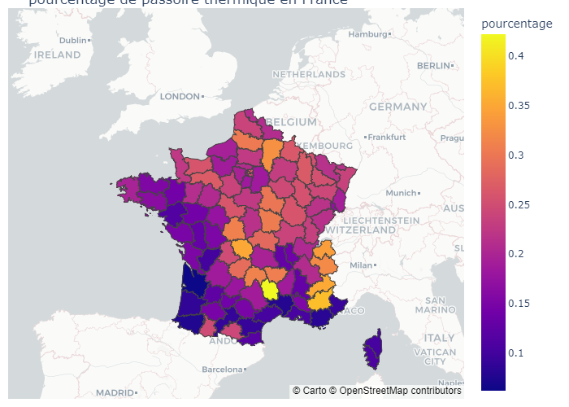

# Energy Performance Diagnosis Analysis

This repository contains a Python-based analysis of Energy Performance Diagnosis (EPD) data in France before 2021.

## Project Overview

The analysis leverages Python's powerful data manipulation and visualization libraries to process EPD data. By exploring key indicators such as energy consumption, thermal performance, and building efficiency, the analysis provides a comprehensive understanding of energy performance metrics.

## Features

- **Data Preprocessing:** Cleaning and structuring raw EPD datasets for analysis.
- **Visualization:** Creating insightful plots and graphs to identify trends and anomalies.
- **Statistical Analysis:** Calculating key metrics to evaluate energy performance.

## Example

